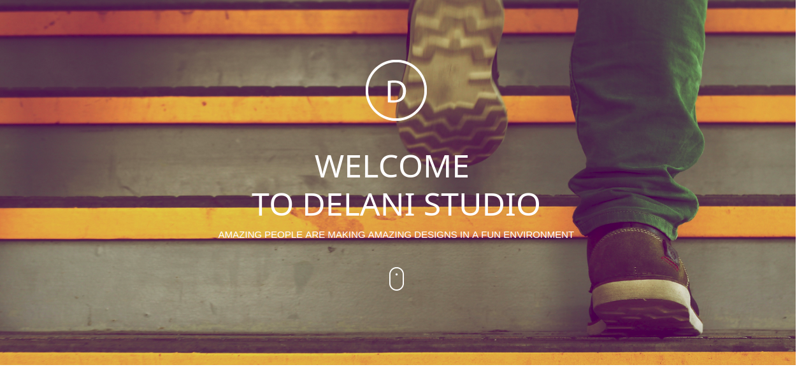

# Delani-studio
# Author
[Firdausa-Salat](https://github.com/firdausa7)

## Description
This is a Portfolio for delani studio showing all previous projects we've worked on.


## Screenshot


## Live page

[https://firdausa7.github.io/Delani-studio/]

## Installation
* Open Terminal {Ctrl+Alt+T}

* git clone ```https://github.com/firdausa7/Delani-studio.git```

* cd Delani-studio

* code . 


## Technology used
* HTML
* CSS
* BOOTSRAP
* JAVASCRIPT
* JQUERY

## Contact information
If you have any question or contributions, please email me at [firdausa.salat@gmail.com]

## License
* MIT LICENSE:
* Copyright (c) 2019 **FIRDAUSA SALAT**


